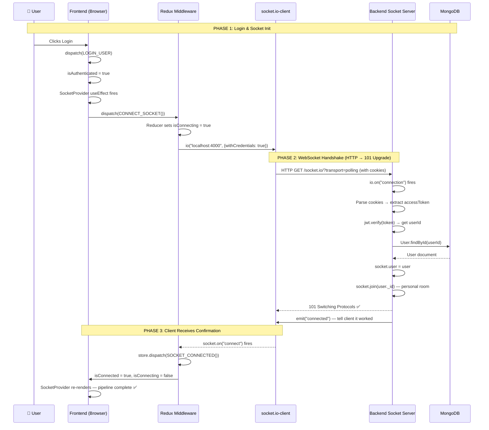

# Socket Connection Pipeline — Full Map

## The Big Picture

Your socket pipeline has **3 layers** that need to talk to each other. Here's the complete map from the moment a user logs in to real-time chat events flowing:



---

## What You Already Have ✅

| Layer | File | Status |
|-------|------|--------|
| **Frontend Redux State** | `socketReducer.ts` | ✅ Done — CONNECT_SOCKET, CONNECTED, DISCONNECTED, ERROR |
| **Frontend Trigger** | `SocketProvider.tsx` | ✅ Done — watches isAuthenticated, dispatches CONNECT_SOCKET |
| **Frontend Middleware** | `socketMidlleware.ts` | ⚠️ Has the structure, but socket code is commented out |
| **Backend Socket Server** | `app.js` | ✅ Done — `io` instance created with CORS |
| **Backend Socket Handler** | `sockets/index.js` | ⚠️ Only has `emitSocketEvents`, missing `initializeSocketIO` |
| **Backend Constants** | `constant.js` | ✅ Done — All ChatEventEnum values defined |
| **Backend Server** | `server.js` | ⚠️ Missing `initializeSocketIO(io)` call |

---

## What Needs To Be Done

### Step 1: Backend — Create `initializeSocketIO` in `sockets/index.js`

This is the **backend's socket connection handler**. When the frontend's `io("localhost:4000")` hits the backend, this function catches it.

The reference code you shared is exactly what you need, adapted for your project:

```javascript
// sockets/index.js

import cookie from "cookie";
import jwt from "jsonwebtoken";
import { ChatEventEnum } from "../constant.js";
import User from "../models/user.model.js";  // adjust to YOUR model path

const mountJoinChatEvent = (socket) => {
  socket.on(ChatEventEnum.JOIN_CHAT_EVENT, (chatId) => {
    console.log(`User joined the chat 🤝. chatId: `, chatId);
    socket.join(chatId);
  });
};

const mountParticipantTypingEvent = (socket) => {
  socket.on(ChatEventEnum.TYPING_EVENT, (chatId) => {
    socket.in(chatId).emit(ChatEventEnum.TYPING_EVENT, chatId);
  });
};

const mountParticipantStoppedTypingEvent = (socket) => {
  socket.on(ChatEventEnum.STOP_TYPING_EVENT, (chatId) => {
    socket.in(chatId).emit(ChatEventEnum.STOP_TYPING_EVENT, chatId);
  });
};

const initializeSocketIO = (io) => {
  return io.on("connection", async (socket) => {
    try {
      // 1. Parse cookies from the handshake (withCredentials: true makes this possible)
      const cookies = cookie.parse(socket.handshake.headers?.cookie || "");
      let token = cookies?.accessToken;

      // 2. Fallback: check handshake auth (for mobile apps or non-cookie clients)
      if (!token) {
        token = socket.handshake.auth?.token;
      }

      if (!token) {
        throw new Error("Un-authorized handshake. Token is missing");
      }

      // 3. Verify the JWT
      const decodedToken = jwt.verify(token, process.env.ACCESS_TOKEN_SECRET);

      // 4. Find the user
      const user = await User.findById(decodedToken?._id).select(
        "-password -refreshToken"
      );

      if (!user) {
        throw new Error("Un-authorized handshake. Token is invalid");
      }

      // 5. Attach user to socket
      socket.user = user;

      // 6. Join a personal room (for sending notifications even without active chat)
      socket.join(user._id.toString());

      // 7. Tell client: "You're connected!"
      socket.emit(ChatEventEnum.CONNECTED_EVENT);
      console.log("User connected 🗼. userId: ", user._id.toString());

      // 8. Mount chat-specific events
      mountJoinChatEvent(socket);
      mountParticipantTypingEvent(socket);
      mountParticipantStoppedTypingEvent(socket);

      // 9. Handle disconnect
      socket.on(ChatEventEnum.DISCONNECT_EVENT, () => {
        console.log("User disconnected 🚫. userId: " + socket.user?._id);
        if (socket.user?._id) {
          socket.leave(socket.user._id);
        }
      });

    } catch (error) {
      socket.emit(
        ChatEventEnum.SOCKET_ERROR_EVENT,
        error?.message || "Something went wrong while connecting to the socket."
      );
    }
  });
};

const emitSocketEvents = (req, roomId, event, payload) => {
  req.app.get("io").in(roomId).emit(event, payload);
};

export { initializeSocketIO, emitSocketEvents };
```

> [!IMPORTANT]
> You need to install the `cookie` npm package in your backend: `npm install cookie`

> [!IMPORTANT]
> Adjust the User model import path to match YOUR project structure (check `backend/src/models/`)

---

### Step 2: Backend — Call `initializeSocketIO(io)` in `app.js`

After creating the `io` instance and before exporting, you need to actually activate the socket handler:

```diff
 import {Server} from 'socket.io'
+import { initializeSocketIO } from './sockets/index.js'

 // ... after creating io ...

 app.set("io" , io)
+initializeSocketIO(io)
```

---

### Step 3: Frontend — Uncomment `socketMiddleware.ts`

Uncomment the socket.io-client code so when `CONNECT_SOCKET` is dispatched, it actually connects:

```javascript
if (action.type === "socket/CONNECT_SOCKET") {
    console.log("received socket connection request")
    
    if(socketInstance?.connected){
        return next(action)
    }
   
    socketInstance = io('http://localhost:4000', {withCredentials: true})

    socketInstance.on('connect', () => {
        console.log('Socket connected successfully!', socketInstance?.id)
        store.dispatch(SOCKET_CONNECTED())
    })

    socketInstance.on('disconnect', () => {
        console.log('Socket disconnected', socketInstance?.id)
        store.dispatch(SOCKET_DISCONNECTED())
        socketInstance = null
    })

    socketInstance.on('connect_error', (error) => {
        console.error('Socket connection error:', error)
        store.dispatch(SOCKET_ERROR(error.message))
        socketInstance = null
    })
}
```

---

## The Complete Flow (Step by Step)

```
┌─────────────────────────────────────────────────────────────────────┐
│                        FRONTEND (Browser)                          │
│                                                                     │
│  1. User logs in                                                    │
│     └─> LOGIN_USER reducer → isAuthenticated = true                │
│                                                                     │
│  2. SocketProvider.tsx useEffect detects isAuthenticated = true      │
│     └─> dispatch(CONNECT_SOCKET())                                 │
│                                                                     │
│  3. socketReducer.ts catches CONNECT_SOCKET                         │
│     └─> isConnecting = true                                        │
│                                                                     │
│  4. socketMiddleware.ts intercepts CONNECT_SOCKET                   │
│     └─> io('http://localhost:4000', {withCredentials: true})       │
│         This sends an HTTP request WITH your accessToken cookie     │
│                                                                     │
└──────────────────────────┬──────────────────────────────────────────┘
                           │
                           │  HTTP Request + Cookies
                           │  (Browser automatically attaches cookies
                           │   because withCredentials: true)
                           │
                           ▼
┌─────────────────────────────────────────────────────────────────────┐
│                        BACKEND (Node.js)                            │
│                                                                     │
│  5. Socket.IO Server (app.js) receives the connection request       │
│     └─> io.on("connection") fires inside initializeSocketIO()      │
│                                                                     │
│  6. Parse cookies from handshake headers                            │
│     └─> cookie.parse(socket.handshake.headers.cookie)              │
│     └─> Extract accessToken                                        │
│                                                                     │
│  7. Verify JWT token                                                │
│     └─> jwt.verify(token, ACCESS_TOKEN_SECRET)                     │
│     └─> Get user._id from decoded token                            │
│                                                                     │
│  8. Find user in MongoDB                                            │
│     └─> User.findById(decodedToken._id)                            │
│                                                                     │
│  9. Attach user to socket & join personal room                      │
│     └─> socket.user = user                                         │
│     └─> socket.join(user._id.toString())                           │
│                                                                     │
│  10. Emit "connected" event back to client                          │
│      └─> socket.emit("connected")                                  │
│                                                                     │
│  11. Mount event listeners for this socket                          │
│      └─> joinChat, typing, stopTyping, disconnect                  │
│                                                                     │
│  12. Server responds with 101 Switching Protocols                   │
│      └─> HTTP connection upgrades to persistent WebSocket          │
│                                                                     │
└──────────────────────────┬──────────────────────────────────────────┘
                           │
                           │  101 Switching Protocols
                           │  + "connected" event
                           │
                           ▼
┌─────────────────────────────────────────────────────────────────────┐
│                     BACK TO FRONTEND                                │
│                                                                     │
│  13. socketMiddleware.ts receives the "connect" callback            │
│      └─> socketInstance.on('connect', () => { ... })               │
│      └─> store.dispatch(SOCKET_CONNECTED())                        │
│                                                                     │
│  14. socketReducer.ts catches SOCKET_CONNECTED                      │
│      └─> isConnected = true                                        │
│      └─> isConnecting = false                                      │
│                                                                     │
│  15. SocketProvider re-renders, sees isConnected = true             │
│      └─> Pipeline complete! 🎉                                     │
│                                                                     │
│  NOW: The WebSocket is alive. Backend can emit events like          │
│  "messageReceived" or "newChat" at any time, and your middleware    │
│  can listen and dispatch Redux actions accordingly.                 │
│                                                                     │
└─────────────────────────────────────────────────────────────────────┘
```

---

## Authentication Flow for Socket (Key Detail)

> [!NOTE]
> The socket does NOT use a separate login. It piggybacks on your existing HTTP login cookies!

When you logged in via `/api/v1/users/login`, your backend set an `accessToken` cookie in the browser. When `socket.io-client` calls `io('http://localhost:4000', {withCredentials: true})`, the browser **automatically** attaches that same cookie to the WebSocket handshake request. The backend's `initializeSocketIO` then reads that cookie, verifies the JWT, and knows exactly who is connecting.

---

## Files Changed Summary

| # | File | Action |
|---|------|--------|
| 1 | `backend/src/sockets/index.js` | Add `initializeSocketIO` function + mount event handlers |
| 2 | `backend/src/app.js` | Import and call `initializeSocketIO(io)` |
| 3 | `frontend/redux/middleware/socketMidlleware.ts` | Uncomment socket.io-client connection code |

## Open Questions

> [!IMPORTANT]
> 1. What is the exact path to your User model? (e.g., `../models/user.model.js` or different?)
> 2. Do you want me to implement this now, or do you want to implement it yourself using this map?
